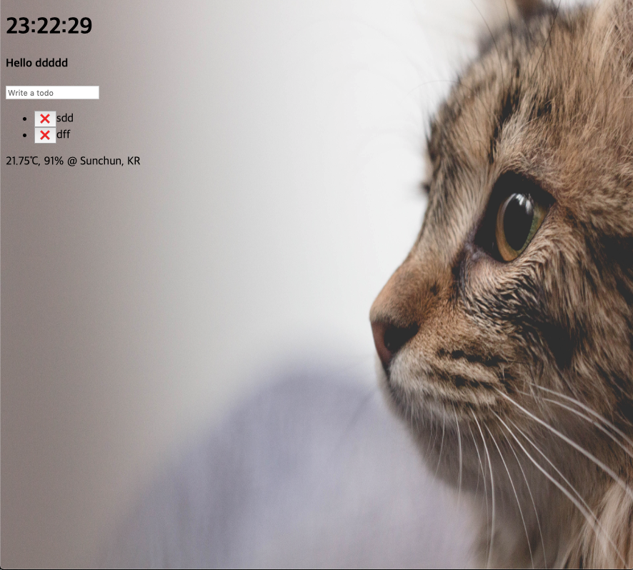
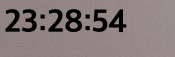
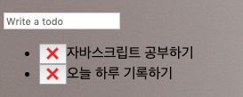
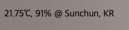

# 
#개발/JS/Momentum

# Welcome my *momentum* repository
[Momentum](https://cckn.github.io/JS-Momentum/)

## 주요 기능

### 시계 표시 
  

### 사용자 이름 

* 입력 및 출력 
* Local Storage 저장 

### TodoList

* 추가 및 삭제
	* 삭제 버튼 이벤트 핸들러
* Local Storage 저장 

### 배경 이미지 

* 저장된 이미지 중 랜덤한 이미지가 배경 이미지로 선택됨 

### 날씨 정보 출력

* 좌표 기반 
* [https://openweathermap.org/](https://openweathermap.org/)  API 이용하여 날씨 및 지역 정보 출력
	

## TODOs

- [ ] CSS 변경 
	- [ ] 가독성 향상시킬 필요가 있음 
	- [ ] 배치 변경
	- [ ] 삭제 버튼 변경
- [ ] 편의성 추가 
	- [ ] 유저 이름 초기화시킬 방안
- [ ] 위치 정보 기능
	- [ ] 최초 위치 정보 Load 후 새로고침 해야 날씨정보가 뜸